# Building a CI/CD Pipeline.

[](https://github.com/elok/AzureND_CICD_Pipeline/actions)

# Overview

In this project, we learn about building out a DevOps CI/CD pipeline. We first start with a GitHub repository and use Github actions to perform an initial lint, test, and install cycles. We then use a pre-trained sklearn model built into a Flask web framework and integrate the project in GitHub with Azure Pipelines to enable Continuous Delivery to Azure App Service.

## Project Plan

* [Link to a Trello board for the project](https://trello.com/invite/b/zW4yWf6g/5bf9cc22582b06615e0a1923b4f38dbe/azure-devops-ci-cd-pipeline)
* [Link to a spreadsheet that includes the original and final project plan](https://docs.google.com/spreadsheets/d/1kz7bNuDeGY3deP0jfT86KPmY1-3nfg7pCFOZpwh7Z68/edit?usp=sharing)

## Architectural Diagrams


## Instructions

We will use Azure Pipelines continuous integration and continuous delivery (CI/CD) to deploy a Python web app to Azure App Service on Linux. You begin by running app code from a GitHub repository locally. You then provision a target App Service through the Azure portal. Finally, you create an Azure Pipelines CI/CD pipeline that automatically builds the code and deploys it to the App Service whenever there's a commit to the repository.

1. Sign into https://portal.azure.com

2. Open Azure Cloud Shell


3. The cloud shell appears at the bottom


4. In the cloud shell, clone the repo

  ```bash
  git clone https://github.com/elok/AzureND_CICD_Pipeline
  ```
  5. Go into the folder

  ```bash
  cd AzureND_CICD_Pipeline
  ```

5. Setup virtual env
  ```bash
  python3 -m venv ~/.myrepo
  source ~/.myrepo/bin/activate
  ```
  
6. Run makefile to install all python requirements, lint, and test

  ```bash
  make all
  ```

  Passing tests that are displayed after running the `make all` command from the `Makefile`
   

7. We will use az webapp up to create an App Service and initially deploy the app
  ```bash
  az webapp up -n <your-appservice>
  ```
  
  > Change <your-appservice> to a name for your app service that's unique across Azure.
  > Typically, you use a personal or company name along with an app identifier, such as 
  > <your-name>-flaskpipelines. The app URL becomes <your-appservice>.azurewebsites.net.
  > When the command completes, it shows JSON output in the Cloud Shell.
 
  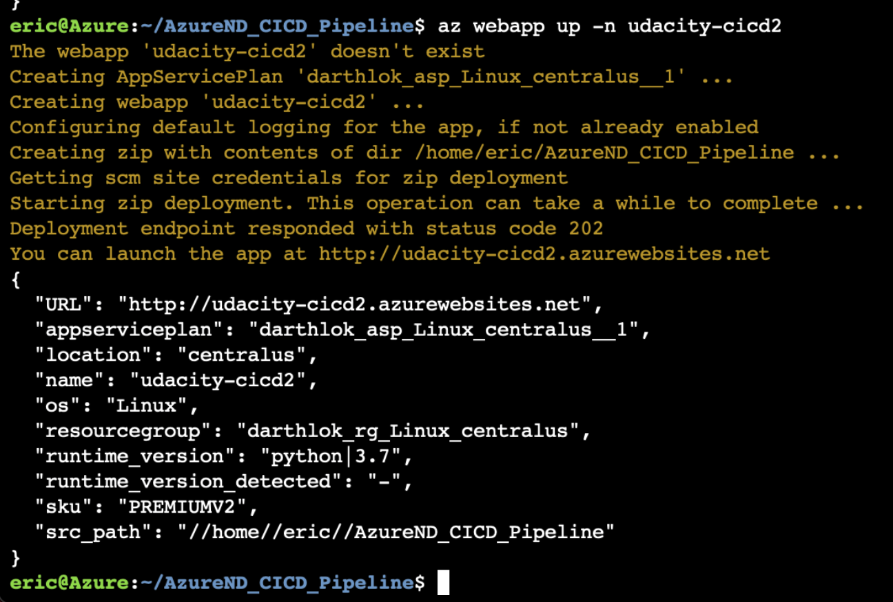
  
  <kbd>
  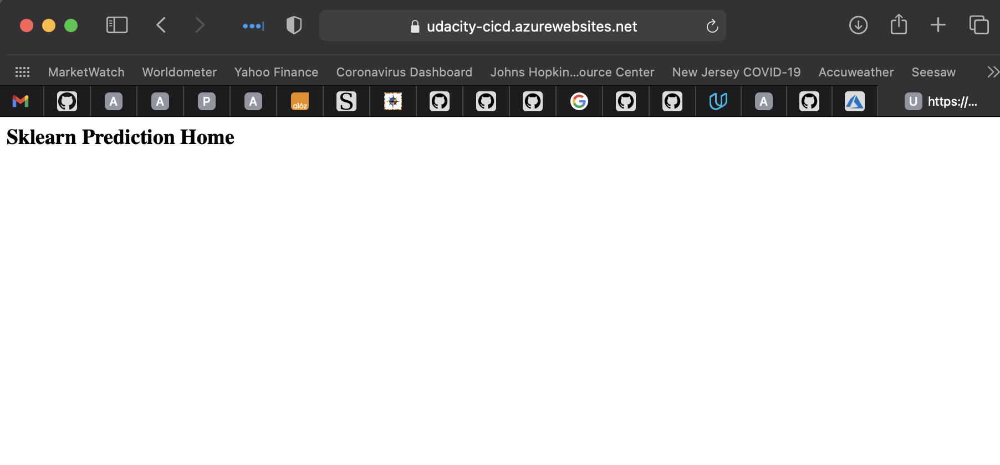
  </kbd>

7. When the command completes, it shows JSON output in the Cloud Shell.

To see the running app, open a browser and go to http://[your-appservice].azurewebsites.net. If you see a generic page, wait a few seconds for the App Service to start, and refresh the page.

8. Test run by running make prediction script

  ```bash
  ./make_prediction_on_azure.sh
  ```
  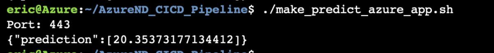

9. Azure DevOps - To deploy to Azure App Service from Azure Pipelines, you need to establish a service connection between the two services.
    1. In a browser, go to dev.azure.com
    2. Once you sign in, the browser displays your Azure DevOps dashboard, at the URL https://dev.azure.com/<your-organization-name>.
    3. Select New project on the organization page. In the Create new project dialog box, enter the project name , and select Create.
    4. From the new project page, select Project settings from the left navigation.
    5. On the Project Settings page, select Pipelines > Service connections, then select New service connection, and then select Azure Resource Manager from the dropdown.
    6. In the Add an Azure Resource Manager service connection dialog box:
      - Give the connection a name. Make note of the name to use later in the pipeline.
      - For Scope level, select Subscription.
      - Select the subscription for your App Service from the Subscription drop-down list.
      - Under Resource Group, select your resource group from the dropdown.
      - Make sure the option Allow all pipelines to use this connection is selected, and then select OK.

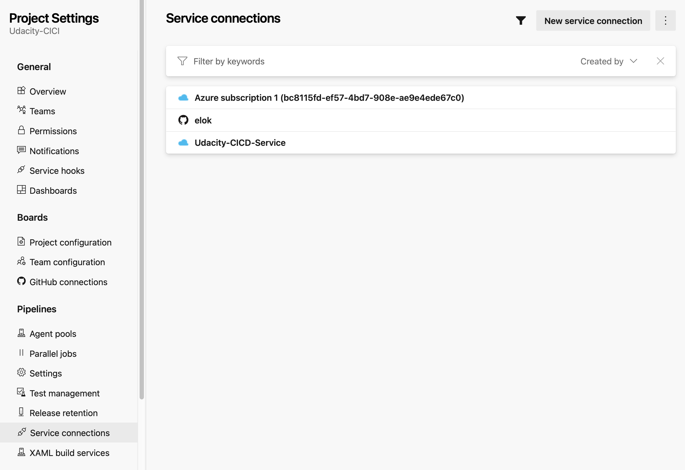

10. Azure Pipelines - Create a Python-specific pipeline to deploy to App Service
    1. From your project page left navigation, select Pipelines.
    2. Select New pipeline
    3. On the Where is your code screen, select GitHub. You may be prompted to sign into GitHub.
    4. On the Select a repository screen, select the repository that contains your app, such as your fork of the example app.
    5. You may be prompted to enter your GitHub password again as a confirmation, and then GitHub prompts you to install the Azure Pipelines extension
    6. On the Configure your pipeline screen, select Python to Linux Web App on Azure. 
    Your new pipeline appears. When prompted, select the Azure subscription in which you created your Web App.

    Select the Web App
    Select Validate and configure

    Azure Pipelines creates an azure-pipelines.yml file that defines your CI/CD pipeline as a series of stages, Jobs, and steps, where each step contains the details for different tasks and scripts. Take a look at the pipeline to see what it does. Make sure all the default inputs are appropriate for your code.
  
<kbd>
  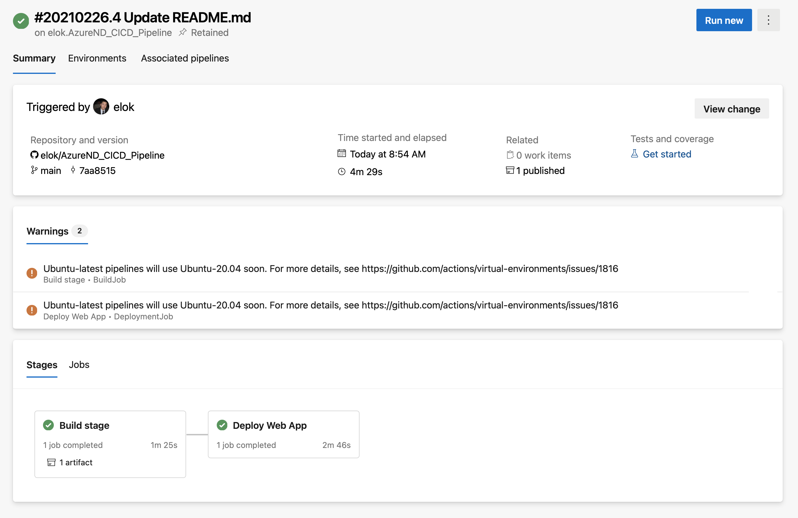
</kbd>
<kbd>
  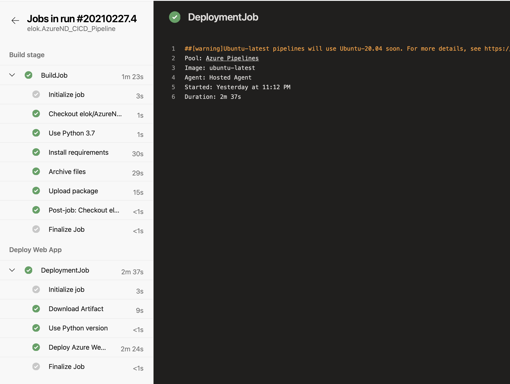
</kbd>
<kbd>
  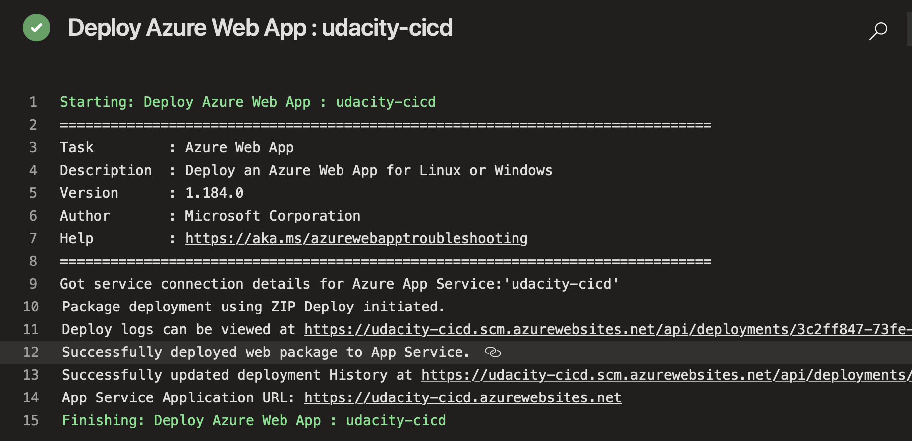
</kbd>  
<kbd>
  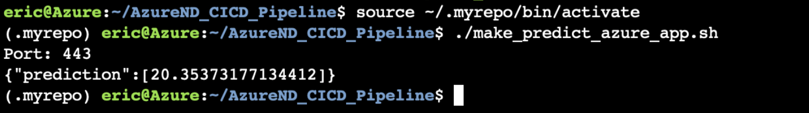
</kbd>  

[Use CI/CD to deploy a Python web app to Azure App Service on Linux](https://docs.microsoft.com/en-us/azure/devops/pipelines/ecosystems/python-webapp?view=azure-devops)

10. Locust

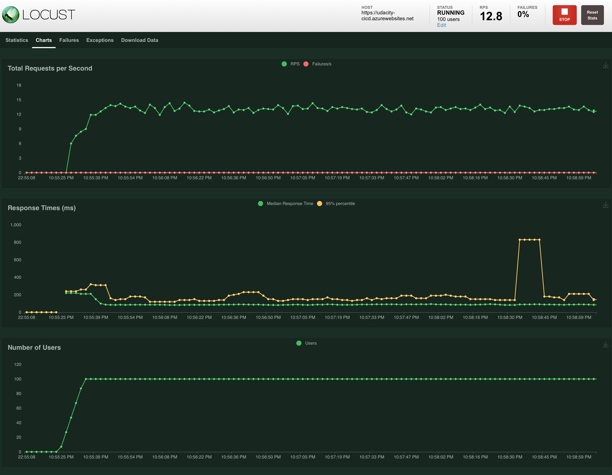

11. Streamed log files from deployed application

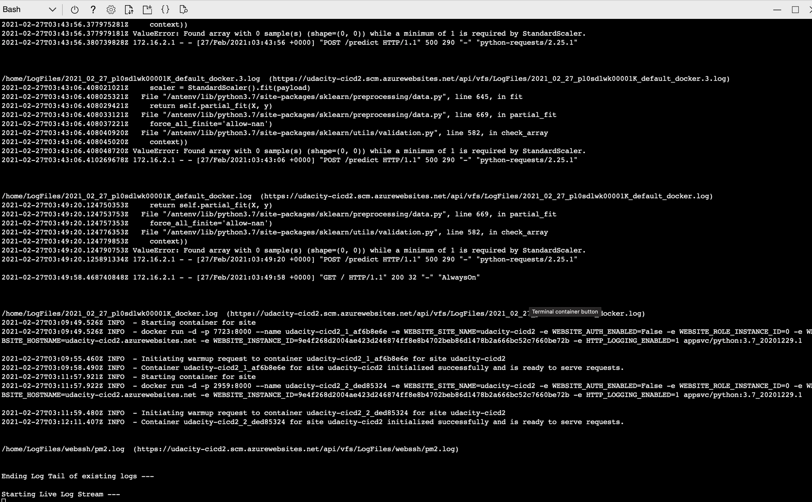

## GitHub Actions

<kbd>
  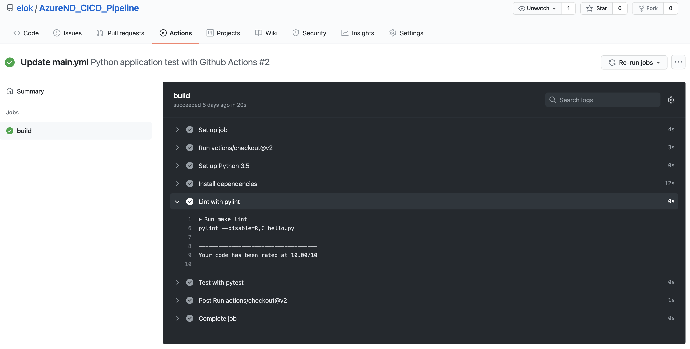
</kbd>  

## Enhancements

- Incorporate other forms of test
- Incorporate an option for manual deployment for sensitive applications

## Demo 

<TODO: Add link Screencast on YouTube>
